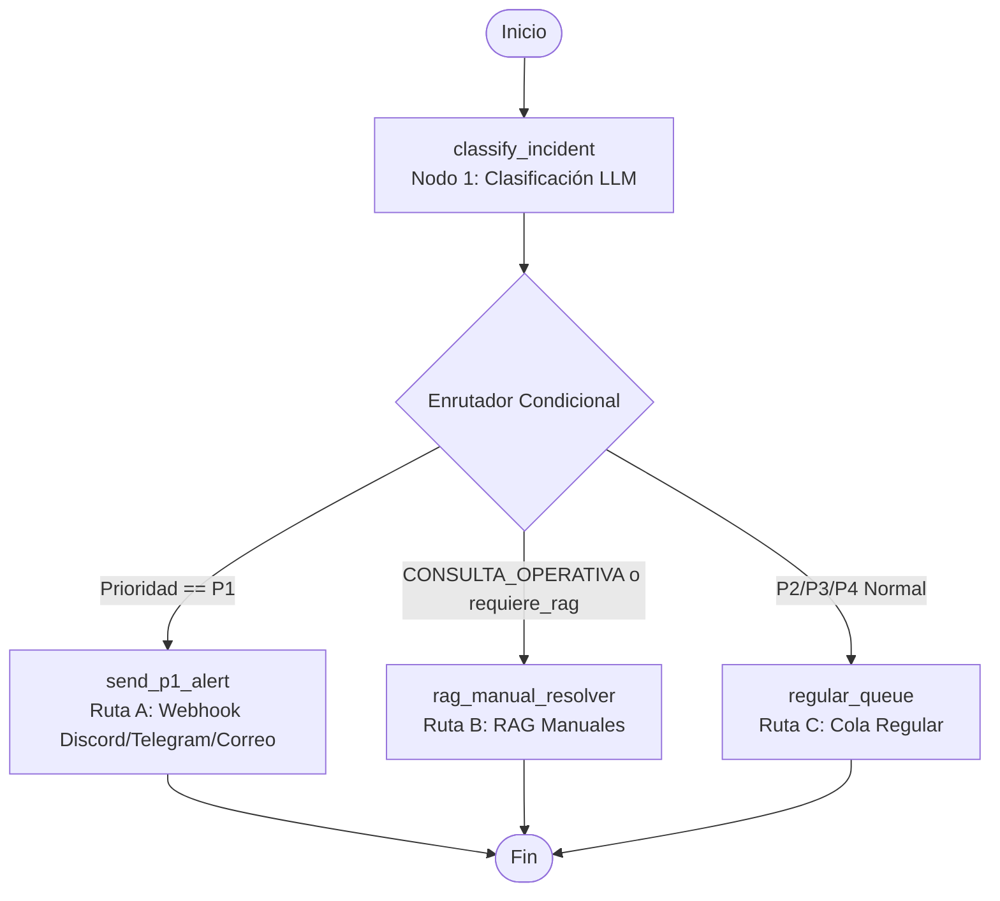

# Intelligent Incident Triage

API desarrollada con FastAPI y orquestada con **LangGraph** para el triaje inteligente automatizado de incidencias de TI mediante LLM (Google Gemini o Groq) y enrutamiento condicional especializado.

## Estructura del Proyecto

```
intelligent-incident-triage/
├── .venv/                   # Entorno virtual de Python
├── graph/                   # Orquestación con LangGraph
│   ├── __init__.py          # Exporta triage_graph
│   ├── state.py             # Estado tipado (IncidentGraphState)
│   ├── llm.py               # Fábrica de modelos LLM (Gemini / Groq)
│   ├── workflow.py          # Definición del StateGraph y router condicional
│   └── nodes/               # Nodos del flujo
│       ├── __init__.py
│       ├── classifier.py    # Nodo 1: Clasificación estructurada y cálculo de SLA
│       ├── alert.py         # Nodo 2A: Envío de alertas P1 vía Webhook (Discord/Telegram/Correo)
│       ├── rag.py           # Nodo 2B: Búsqueda en manuales (pgvector) y solución sugerida
│       └── queue.py         # Nodo 2C: Registro directo en cola regular de atención
├── schemas.py               # Enums, matriz de prioridad y modelos Pydantic
├── main.py                  # API FastAPI y endpoints
├── test_graph.py            # Pruebas del grafo, enrutador y las 3 rutas
├── test_main.py             # Pruebas de endpoints FastAPI
├── requirements.txt         # Dependencias del proyecto
├── .env.example             # Plantilla de variables de entorno
└── .gitignore               # Archivos ignorados por git
```

---

## Estado del Grafo (`IncidentGraphState`)

Conforme el ticket avanza de nodo en nodo, cada función lee este estado tipado y le añade sus resultados:

```python
class IncidentGraphState(TypedDict):
    texto_original: Dict[str, Any]       # {"titulo": ..., "descripcion": ..., "usuario": ...}
    triage_data: Optional[IncidentAnalysis]  # Clasificación del Nodo 1 (categoría, SLA, etc.)
    alert_sent: bool                     # True si se disparó alerta P1
    rag_context: Optional[List[str]]     # 2 fragmentos recuperados de manuales
    final_response: Optional[str]        # Solución sugerida o confirmación de cola
    error: Optional[str]                 # Control de errores si los hubiera
```

---

## Flujo de Orquestación



### Rutas del Segundo Nodo:
1. **Ruta A (Alerta P1)**:
   - Se activa si `prioridad == P1`.
   - Envía notificación formateada: `🚨 ALERTA P1: [resumen]. SLA: 2 horas. Responsable: Turno de guardia.`
   - Soporta Webhooks hacia Discord, Telegram o Correo/Genérico.
2. **Ruta B (RAG Manuales)**:
   - Se activa si `categoria == CONSULTA_OPERATIVA` o `requiere_rag == True`.
   - Recupera los 2 fragmentos más relevantes de manuales y redacta una solución sugerida automática mediante el LLM.
3. **Ruta C (Cola Regular)**:
   - Se activa para incidentes normales (P2, P3, P4) que no son críticos y no requieren manual.
   - Omite alertas y RAG, registrando el incidente en la cola de atención regular.

---

## Configuración y Variables de Entorno

1. Copia `.env.example` a `.env`:
   ```powershell
   Copy-Item .env.example .env
   ```

2. Configura las variables deseadas:
   ```ini
   LLM_PROVIDER=gemini
   GEMINI_API_KEY=tu_api_key_de_gemini

   # Opciones de Webhook para alertas P1:
   DISCORD_WEBHOOK_URL=https://discord.com/api/webhooks/...
   # TELEGRAM_BOT_TOKEN=...
   # TELEGRAM_CHAT_ID=...
   # EMAIL_WEBHOOK_URL=...
   ```

## Ejecución del Servidor

```powershell
.\.venv\Scripts\uvicorn main:app --reload --port 8000
```
- Swagger UI: [http://127.0.0.1:8000/docs](http://127.0.0.1:8000/docs)

## Pruebas Automatizadas

```powershell
.\.venv\Scripts\pytest -v
```
